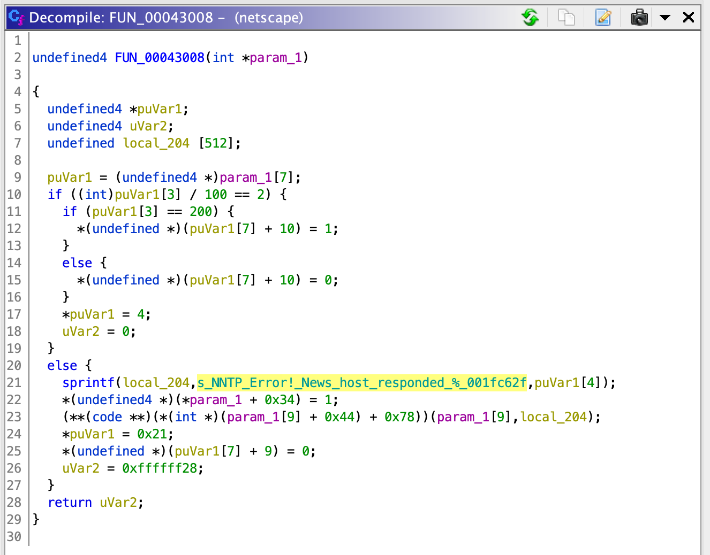

# Back to the Future&emsp;Pwn, 400 points

## Story

> After picking up the fallen modem, you turn back to the stack of hardware to return it when something strange about the modem itself catches the corner of your eye. It looks like the bottom of the modem has some nonstandard hardware for networking in the 1990's. There are three (are those fuses?) arranged in a triangular pattern, radiating from a node in the center of the modem, before each connecting to some components back inside the plastic shell near the edges. You can't imagine what the function of those could possibly be, but your interest is piqued. Getting a weird sense of deja vu, you decide to investigate further.
>
> You suddenly realize why the arrangement of fuses on the bottom of the modem feels familiar; they aren't fuses at all, they're a Flux Capacitor like the one from Back to the Future! So if it's attached to a modem, then... it's sending data through time? But surely this hardware couldn't actually send packets to the past, right?!
>
> It’s the one last hope that you’ve been looking for. Maybe you can get a message into the past to warn everyone about the situation. You don’t know how to really control this thing, so you’ll just have to do your best. Even the things you love most don’t last; your best is really all you can do.

(Part of [a larger story](https://docs.google.com/document/d/15NtrJPTbBXqXce_T1z-7nHMPR2eE109fycaviSTnq30).)

## Problem Description

Access your modem here.  (Links to handout and submission site.)

Note: there are requirements for the URL you submit. Please see the source of the submission site for more details.

Hint: The bot is running the binary in an `ubuntu:18.04` container and has a 30-second timeout.

## Design

The setup for this problem arose from a joke -- when we knew we were doing a '90s-adjacent theme for PlaidCTF, several of us joked that it would be funny to have a "browser pwnable" on an incredibly out-of-date browser.  I ended up going with the earliest version of Netscape that I could find and get to run, which turned out to be the 0.96 beta from 1994.

There wasn't much of a design process for this problem since it's a sort of "found art" CTF problem.  However, it _does_ take quite a bit of work to make a binary this old run on a modern system; see `problem/README.md` for more information, both on actually deploying this problem and on the different approaches I tried to make ZMAGIC binaries run on modern Ubuntu.

## Solution

I guessed pretty early on when trying to exploit Netscape that there were probably some trivial stack buffer overflows in Netscape.  It took a lot of work to track one down since I didn't have any libc symbols, but I eventually found a very poorly written `sprintf` call in one section of the NNTP handler:

This allows us to overwrite the stack with arbitrary constants so long as we don't need `\x0a` (since that would end the line) or `\x00` (since that would terminate the string).  An obvious approach forward is to try and ROP our way to a shell, and fortunately, we already have an open socket, so if we can do a couple of `dup2` calls to map the file descriptors correctly then an `execve("/bin/sh")` will give us a shell and we won't need to worry about a connectback.

I tried coming up with a way to ROP to a shell directly, but couldn't come up with a short enough approach; ultimately I decided to try using ROP to write shellcode elsewhere and then jump to it.  Fortunately, the libc is always mapped to the region starting a little bit before `0x60000000` and is mapped as RWX, so it provides a convenient place to drop the shellcode.  Even that concept on its own wasn't short enough, though, so I ended up breaking it down into two phases: first, use the ROP we have to write a helpful gadget, then use the helpful gadget to load our shellcode, and finally jump to our shellcode.

A full solution script (with comments) can be found in the `solution` directory.

## Deployment

This problem can't be naively deployed in docker!  See `problem/README.md` for more details.

Run `problem/handout.sh` to produce the tarfile to hand out to competitors.
