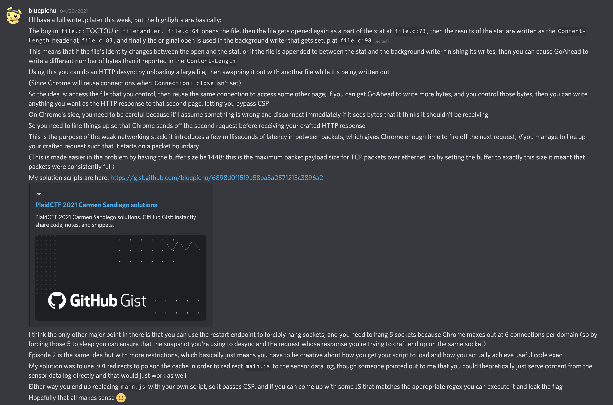

# Carmen Sandiego&emsp;Web, 450 points + 200 points

_Special thanks to Luke and f0xtr0t for testing this problem._

## Problem Description

Carmen isn't your average thief – in fact, she's trying to save the artifacts she steals! Join Carmen, Player, Zach, and Ivy as they protect the world's cultural history from the likes of VILE, one theft at a time. But they have to be careful: ACME thinks they're on the wrong side of the law and will stop at nothing to bring them to justice.

**Episode 1: The Cairo Camera Caper (450 points).** When Carmen's intel indicates that VILE is planning to steal Tutankhamun's Mask from the Egyptian Museum in Cairo, she needs Player's help to bypass an IoT camera system so that she can steal the mask first.

**Episode 2: The Santiago Sensor Caper (200 points).** After VILE captures Carmen during a bank robbery in Santiago, it's up to the rest of the team to figure out why VILE is targeting the bank and how to free her. But just when all hope seems lost, Player notices that the bank has a familiar-looking IoT sensor system...

## Deployment

The entire `problem` directory, which includes the runner infrastructure in addition to the problem itself, is handed out to competitors.  Its README gives instructions on how to run and deploy the problem.

## Issues and Season 2

The original version of this problem had a major bug that allowed for a much easier solution than intended, specifically by allowing attackers to submit a `javascript:` URL and have that execute on-site.  This problem was re-released as _Carmen Sandiego: Season 2_ with the unintended solution patched out and somewhat reduced scores (300 + 150).

This repository contains the Season 2 version.  See `season2.diff` for the relevant diff between the two versions.

## Solution

TODO: a real writeup :)

You can see my solution scripts in the `solution` directory.

